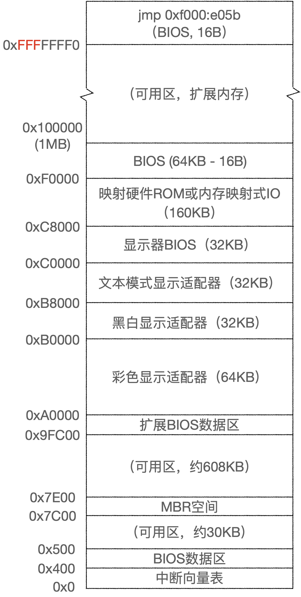
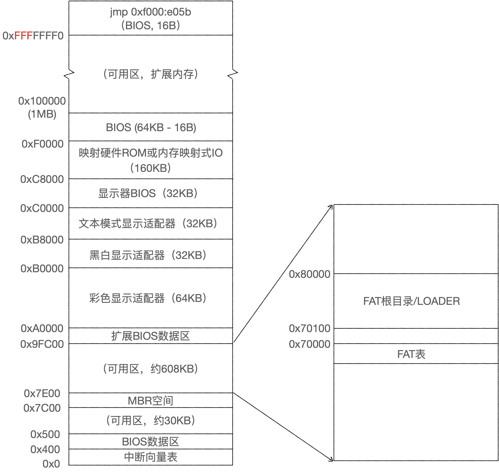
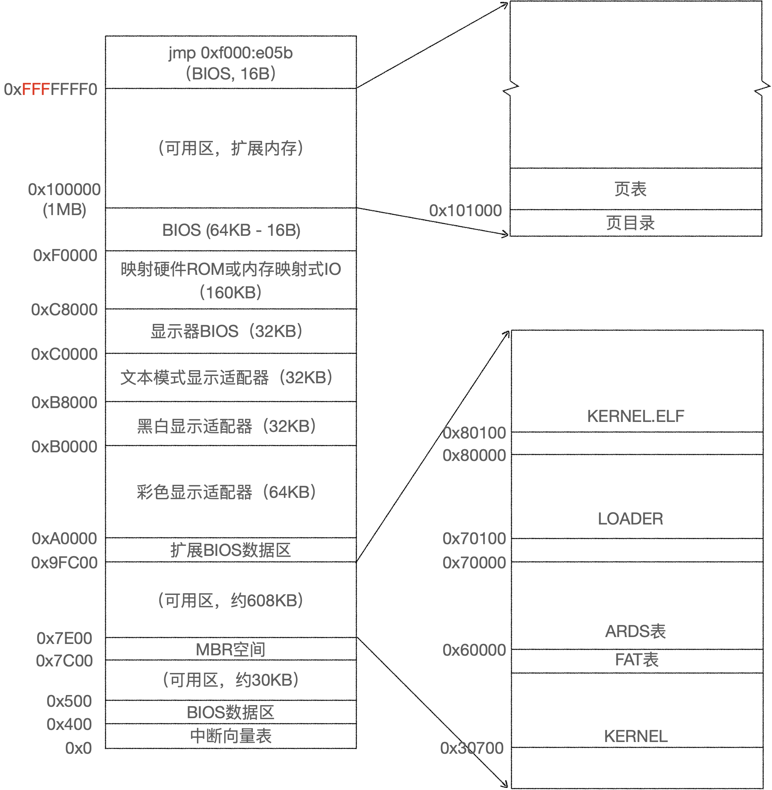

# 内存布局
## BIOS阶段

在386cpu上BIOS被分为两部分，分别位于地址0xFFFFFFF0和0xF000处，位于0xFFFFFFF0的部分只有16字节大小，内含一条jmp指令跳转到0xF000处的部分，对于386之前的cpu这两部分的BIOS是连接在一起的，之所以有这条跳转指令是因为cpu启动后执行的第一条指令必须是一个固定的地址（即系统最高16字节内存处），而各个硬件厂商提供的BIOS大小都不一样，通过这样一条跳转指令cpu便可以跳转到真正的BIOS程序中开始运行BIOS。

实模式下访问0xFFFFFFF0地址是通过硬件实现的，具体是将A20~A31地址线置1，跳转完成后硬件会将A20~A31地址线置0，这样cpu就可以访问位于1MB内存下的BIOS了。

cpu运行BIOS进行自检，然后从启动设备中加载MBR到内存地址0x7C00处，然后执行0x7C00处的代码，进入到MBR引导阶段。
## BOOT阶段

BOOT程序从floppy中将LOADER加载到内存0x70100处，过程中会先将FAT根目录项加载该地址，然后通过搜索FAT根目录查找LOADER，找到后将LOADER加载到此处，覆盖掉根目录。FAT表地址是通过参数计算得来的，要求加载在LOADER前面的段内（即0x6000）并且紧邻0x7000段的地址处。

## LOADER阶段

LOADER先运行在实模式，利用BIOS的子程序获取系统内存信息，并将其缓存在内存0x60000处；然后从floppy中查找KERNEL文件，并加其加载到0x80100地址处。

之后LOADER进入保护模式，先开启分页机制，页表信息保存在0x100000（1MB）地址处；然后解析KERNEL的ELF文件，提取KERNEL代码段并将其加载到0x30700（此地址从ELF信息中读取，编译KERNEL时确定的）处；最后cpu跳转到0x30700处，进入KERNEL代码。

## KERNEL阶段

## 用户态栈
栈底地址为CONFIG_KERNEL_VM_OFFSET，即用户栈从内核起始地址开始向低地址增长，并且大小没有限制。