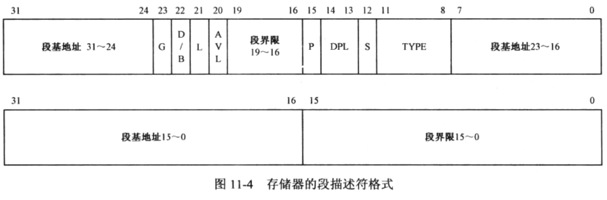
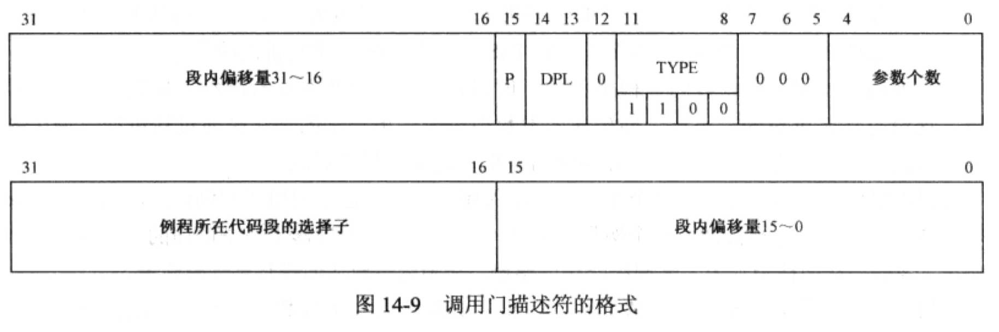
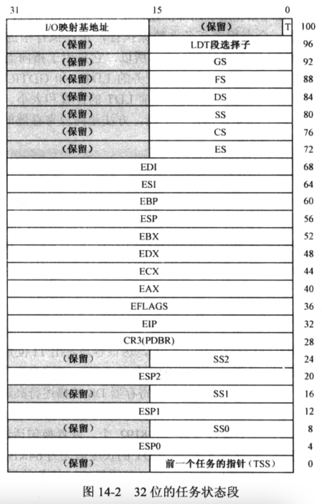

### osx上编译安装bochs
```
brew install sdl2

./configure --enable-debugger --enable-disasm --with-sdl2
make && make install
```

### cygwin安装编译工具
```
# binutils
wget https://mirrors.tuna.tsinghua.edu.cn/gnu/binutils/binutils-2.36.1.tar.xz

./configure --target=x86_64-elf --program-prefix=x86_64-elf-

# gcc
apt-cyg install libgmp-devel libmpfr-devel libmpc-devel

[未成功]./configure --target=x86_64-elf --program-prefix=x86_64-elf-
```


### 字（word）的大小
字指的是cpu一次能够处理的位数，word的大小和cpu结构有关，32位cpu中一个word为32位，64位cpu中一个word为64位，在32位cpu中half-word为16位，与16位cpu中的一个word等长。


### 软盘的扇区

逻辑扇区号（logicSec）从0开始编号。

根据逻辑扇区号计算柱面号、磁头号（正反面）、扇区号，即CHS：

```bash
logicSec / SecsPerTrk = Trks … Sector

Trks / HeadCount = Cylinder … Head
```

SecsPerTrk - 每磁道的扇区数

HeadCount - 磁头数，对软盘来说就是2。

相邻的两个逻辑扇区在物理上是分布在不同的面上的，即逻辑扇区是交替排列在软盘两面的。

### 使用gdb+bochs远程调试内核
```bash
# bochs支持gdb
./configure --enable-gdb-stub

bochsrc:
gdbstub: enabled=1, port=1234, text_base=0, data_base=0, bss_base=0

gdb ./kernel/kernel.elf
(gdb) target remote :1234
(gdb) break xxx
```

### 指令前缀0x66和0x67
在x86指令集中，

0x66前缀的全称是Operand Size Override Prefix，用于翻转指令**操作数**的长度；

0x67前缀的全称是Address Size Override Prefix，用于翻转指令中**有效地址**的长度；

### 反汇编裸二进制（Flat binary）

```bash
objdump -m i386 -b binary -M intel -D a.out
```

### 段描述符
#### 段界限
对于向高地址扩展的段，其段界限是当前段内可访问的最大偏移量。当粒度G=0时，段界限值为段描述符中的limit字段，当G=1时，段界限值为`（limit+1）* 4096 - 1 == limit * 4096 + 4095`。

#### 段扩展方向
扩展方向用于处理器的段界限检查，向上扩展是指向高内存地址扩展。

#### D/B位
用于指定指令指针寄存器是16位还是32位（IP or EIP），和栈指针寄存器是16位还是32位（SP or ESP） 

### 存储器的保护



#### 代码段执行时的保护
即CPU执行指令时检查EIP的合法性，`0 <= (EIP + 指令长度 - 1) <= 实际段界限`

#### 栈操作时的保护
push、pop、call、ret、iret指令执行时的合法性检查，`实际段界限+1 <= (ESP的内容 - 操作数长度) <= 0xFFFFFFFF)`

#### 数据访问时的保护
`0 <= (EA + 操作数长度 - 1) <= 实际段界限`

举例
```asm
mov [0x7000], eax
```
EA = 0x7000, 操作数长度 = 4

### 保护模式的保护措施
1. 引入段描述符，增加段界限限制，GDT
2. 任务隔离，不同任务有各自私有的描述符表（LDT）和任务状态（TSS）
3. 特权级

### 特权级

描述符特权级DPL（Descriptor Privilege Level）是描述符所代表的段的特权级。

当前特权级CPL（Current Privilege Level）是指CPU当前正在执行的指令所在的代码段的特权级（DPL），其值为CS寄存器的低2位。

请求特权级RPL（Request Privilege Level）是选择子低2位的值，在通过调用门进行特权转移时CPU要求操作系统提供与请求者身份相符的特权级（即RPL），以保证高特权代码不会代替低特权代码去访问一个段。操作系统要负责鉴别低特权代码提供的请求是否符合其身份，比如操作系统要校验低特权代码提供的段选择子的RPL是否超出其权限。

非一致性（non-conform）代码段只能在同级特权之间进行控制转移。

任何时候都不允许**主动**将控制从较高特权级转移到较低特权级，原因是高特权级的代码（典型如操作系统）不会引用可靠性比自己低的代码。

一致性（conform）代码段可用于低特权级向高特权级（被设置为一致性代码段）转移，但转移后CPL仍是转移前的特权级，即特权级不变，转移前后是一致的。

除了一致性代码，另一种在特权级之间转移控制的方法是使用门，门描述符用于描述可执行代码，比如一段程序，门的种类：
1. 调用门：用于不同特权级之间的过程调用
2. 中断门/陷阱门：用于中断处理例程
3. 任务门：对应着单个任务，用于任务切换

arpl指令：Adjust RPL Field of Segment Selector，常用于调整应用程序传递给操作系统的段选择子，使其RPL字段的值和应用程序的特权级相匹配。格式：

```assembly
arpl r/m16, r16
```

源操作数为16位通用寄存器，其中包含参考段选择子，常常是应用程序的CS寄存器的值。

目的操作数可以是16位通用寄存器或指向16位内存单元的内存地址，其中包含被调整的段选择子。

#### 总结

##### 控制**直接**转移到**非一致性**代码时

```
CPL = 目标代码段DPL
RPL = 目标代码段DPL
```

##### 控制直接转移到**一致性**代码段时

```
CPL ≥ 目标代码段DPL
RPL ≥ 目标代码段DPL
```

P.S. 转移后，CPL不会发生变化。

##### 通过调用门进行控制转移时

##### 数据访问，高特权可以访问低特权数据，反之不允许

```
CPL ≤ 目标数据段DPL
RPL ≤ 目标数据段DPL
```

这里数据段是指通用数据段DS、ES、FS、GS

##### 栈段访问，必须同特权级才可以访问

```
CPL = 目标栈段DPL
RPL = 目标栈段DPL
```


### 调用门（Call Gate）



jmp far Gate：通过调用门将控制转移到更高的特权级代码中，但不改变CPL。

call far Gate：同上，但会改变CPL，CPL提升为目标代码段的DPL。

使用调用门时的特权等级要求：

```
CPL ≤ 调用门DPL(下限)
RPL ≤ 调用门DPL
CPL ≥ 调用门指向的目标代码段DPL(上限)
```

这里的RPL是指调用门选择子的RPL，调用门描述符中的代码段选择子RPL会被忽略（引用自：《80x86汇编语言程序设计教程》 10.6.3 任务内不同特权级的变换）

### 任务

任务状态段TSS结构



